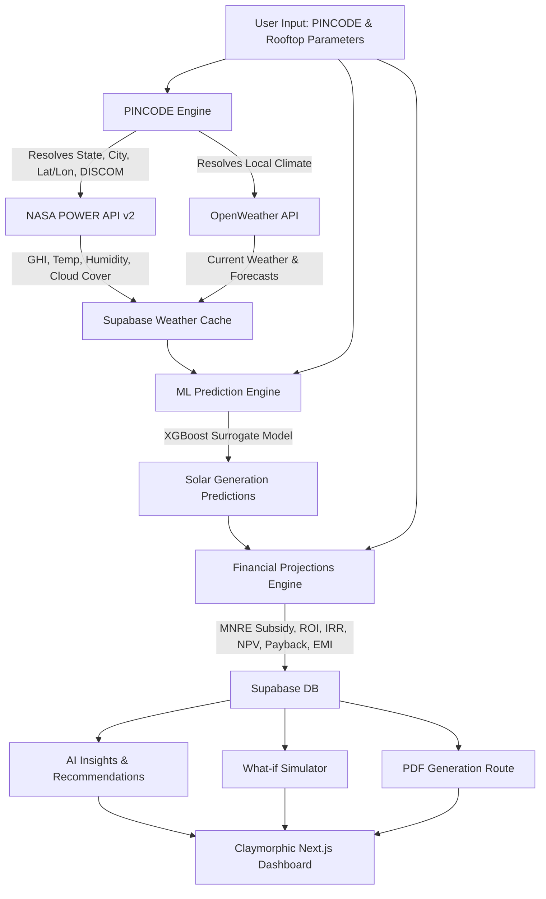

# SolarIQ India — System & Visual Architecture

SolarIQ India is an AI-powered solar feasibility platform for Indian rooftops. It leverages real-time NASA satellite solar irradiance and meteorological data, combined with local electricity tariff rates and state-by-state government subsidy structures under the **MNRE PM Surya Ghar Muft Bijli Yojana (2024)**, to deliver institutional-grade feasibility reports.

This document details the system design, visual language, frontend screens, data models, machine learning pipeline, and calculation engines.

---

## 🗺️ System Architecture Flow

The following diagram illustrates how user inputs are processed through the external API integrations, the XGBoost ML model, and local financial/feasibility engines to populate the Supabase database and render the dashboard.



---

## 🎨 Visual Design Language & Aesthetics

SolarIQ implements a custom **Claymorphic Design System** rather than traditional flat or material UI. This gives the interface a premium, soft, three-dimensional look resembling clay or sculpted glass, which is responsive, highly tactile, and clean.

### Core Clay Styling Tokens

The theme variables defined in [globals.css](file:///c:/Users/LENOVO/Downloads/solar-iq/solar-iq/src/app/globals.css) form the foundation:

*   **Background Color:** `#e8edf2` (A cool, soft, low-contrast gray-blue)
*   **Surface Color:** `#ecf0f5` (Slightly lighter gray-blue for raised surfaces)
*   **Clay Shadows:**
    *   **Raised Shadow (`--shadow-clay`):** `8px 8px 16px #b8bec7, -8px -8px 16px #ffffff` (Soft dark shadow on the bottom-right, clean white highlight on the top-left)
    *   **Pressed/Inset Shadow (`--shadow-clay-inset`):** `inset 4px 4px 8px #b8bec7, inset -4px -4px 8px #ffffff` (Used for active buttons and form input fields to create a hollowed-out look)
*   **Border Radius:** Soft, heavily rounded corners (`14px` for buttons, `20px` for cards, and up to `36px` for large containers).

### Brand & Glow Colors
*   ☀️ **Solar Amber (`--color-solar`):** `#f59e0b` / `#d97706` (Primary theme color for solar gauges, active navigation, and primary CTAs)
*   🌿 **Eco Emerald (`--color-eco`):** `#10b981` / `#059669` (Used for ecological metrics, cash savings, and high suitability scores)
*   📊 **Data Blue (`--color-data`):** `#3b82f6` / `#2563eb` (Used for ML model confidence, chart curves, and data metrics)
*   🚨 **Danger Red (`--color-danger`):** `#ef4444` (Used for system losses, heavy shading warnings, and deletion buttons)

### Micro-Animations & Interactivity
1.  **Button Hover Translation:** Buttons (`.clay-btn`) float slightly upwards (`translate-y-[-1px]`) on hover and drop into a pressed inset state on active click.
2.  **Solar Pulse:** Critical action elements (e.g., "Analyse My Roof") have a subtle breathing box-shadow animation (`solar-pulse`) that transitions between low and high amber glow intensities.
3.  **Radial Gauge Animation:** Feasibility scores load with a CSS stroke-dashoffset transition (`score-ring`) that sweeps from 0 to the target percentage.

---

## 🖥️ Page Layouts & Screens

### 1. Landing Page
*   **Path:** [page.tsx](file:///c:/Users/LENOVO/Downloads/solar-iq/solar-iq/src/app/page.tsx)
*   **Look & Feel:** High-end marketing page featuring a centered hero section with a floating country badge (`Built for Indian households & businesses`).
*   **Elements:** 
    *   An animated main heading featuring a prominent yellow-to-orange gradient on the word "Worth It".
    *   A grid of four stat cards showing typical payback metrics.
    *   An interactive feature catalog utilizing hover-responsive clay cards.
    *   A bottom call-to-action (CTA) container with a soft golden glow.

### 2. Dashboard Home
*   **Path:** [page.tsx](file:///c:/Users/LENOVO/Downloads/solar-iq/solar-iq/src/app/%28dashboard%29/dashboard/page.tsx)
*   **Look & Feel:** Split-screen layout with a persistent sidebar. It uses clean, readable metrics.
*   **Elements:**
    *   **Sidebar Navigation:** Active routes highlighted in solid Amber with a soft clay shadow.
    *   **Quick Stats:** Cards detailing total analyses, completed reports, and account plan type.
    *   **Empty State:** If no reports exist, a large clay illustration guides the user to trigger their first run.
    *   **Recent Reports Table:** A vertical list of past analysis records displaying name, location, system capacity in kWp, and overall feasibility score inside a colored circular badge.

### 3. Four-Step Analysis Wizard
*   **Path:** [AnalysisWizard.tsx](file:///c:/Users/LENOVO/Downloads/solar-iq/solar-iq/src/components/analysis/AnalysisWizard.tsx)
*   **Look & Feel:** A step-by-step questionnaire using inset inputs and multi-choice selections.
*   **Step Elements:**
    1.  **Step 1: Location:** User inputs PINCODE or city. The app auto-detects latitude/longitude and identifies the local electricity distribution company (DISCOM).
    2.  **Step 2: Property:** Interactive option cards to select property type (Residential, Commercial, Industrial, Agricultural), roof orientation (South, East, West, North), and roof construction material.
    3.  **Step 3: Energy:** Numeric entry and slider controls for monthly electricity bills (in INR) and average monthly consumption (in kWh).
    4.  **Step 4: Budget & Hardware:** Fields for user budget and panel hardware preferences (e.g., Mono-PERC, TOPCon, HJT, Bifacial).

### 4. Feasibility Report & Results Page
*   **Path:** [page.tsx](file:///c:/Users/LENOVO/Downloads/solar-iq/solar-iq/src/app/%28dashboard%29/analysis/%5Bid%5D/page.tsx)
*   **Look & Feel:** Complex grid-based dashboard presenting complex calculations in digestible widgets.
*   **Widgets:**
    *   **AI Solar Readiness Gauge:** A large radial gauge rendering the readiness score (0-100) with detailed rating verdicts (e.g., "Excellent Solar Potential").
    *   **Property Suitability Score:** A secondary rating card indicating qualitative feedback.
    *   **Solar Health Index Card:** Displays a performance health rating reflecting dust, temperature, and shading coefficients.
    *   **ML Generation Confidence Interval:** Shows predicted annual generation alongside lower and upper bounds corresponding to model variance.
    *   **Explainable AI Feature Importance Chart:** A horizontal bar chart mapping how different variables impacted the ML model's prediction.
    *   **Core Metrics Grid:** Flat-layout summaries of recommended system capacity, annual generation, net investment cost, and payback period.
    *   **25-Year Projections Charts:** Multi-tab line and bar charts tracking generation degradation and cumulative financial returns over 25 years.
    *   **What-if Simulator:** Interactive sliders allowing users to dynamically modify shading, cleaning frequency, or panel types to see real-time updates on payback and ROI.
    *   **EMI Cashflow Calculator:** Compares estimated solar loan monthly installments against electricity bill savings to illustrate immediate positive monthly cash flow.

---

## 🗄️ Database Architecture

SolarIQ uses Supabase (PostgreSQL) with a highly structured relational database model. It features strict **Row-Level Security (RLS)**, ensuring users can only read and write their own property data.

The schema is defined in [001_complete_schema.sql](file:///c:/Users/LENOVO/Downloads/solar-iq/solar-iq/supabase/migrations/001_complete_schema.sql):

```
                                  +---------------------+
                                  |        users        |
                                  +---------------------+
                                             | 1
                                             |
                                             | 1..*
                                  +---------------------+
                                  |     properties      |
                                  +---------------------+
                                             | 1
                                             |
                                             | 1..*
                                  +---------------------+
                                  |    roof_analyses    | <----------+
                                  +---------------------+            |
                                    | 1            | 1               |
                                    |              |                 |
                                    | 1            | 1               |
                             +------------+  +------------+          | 1
                             |user_inputs |  |suitability |          |
                             +------------+  |   scores   |          |
                                             +------------+          |
                                                   | 1               |
                                                   |                 |
                                                   | 0..1            |
                                             +------------+          |
  +------------------+ 1..*                  | financial  |          |
  |   weather_data   | <---------------+     |  analyses  |          |
  +------------------+                 |     +------------+          |
                                       |           | 1               |
                                       |           |                 |
                                       | 1         | 1               |
                                     +----------------------+        |
                                     |  solar_predictions   | -------+
                                     +----------------------+
                                               | 1
                                               |
                                               | 1..*
                                     +----------------------+
                                     |panel_recommendations |
                                     +----------------------+
```

### Table Dictionary

1.  **`users`**: Extends the default Supabase `auth.users` table. Stores subscription plans (`free`, `starter`, `pro`, `enterprise`) and credit usage.
2.  **`properties`**: Records location metadata (pincode, city, state, coordinates) and building type.
3.  **`roof_analyses`**: Holds computer vision / layout dimensions including total roof area, usable area, shading percentage, structural obstacles, and processing time.
4.  **`user_inputs`**: Logs financial baseline values like utility bill, consumption, average tariff, and battery storage preferences.
5.  **`weather_data`**: Acts as a geo-cache for NASA POWER API data. Stores coordinates, annual and monthly GHI (Global Horizontal Irradiance), daily sun hours, temperature, humidity, cloud cover, and seasonal profiles. Records expire and refresh after 30 days to avoid unnecessary API costs.
6.  **`solar_predictions`**: Core estimation table. Saves recommended panel specs, system size (kWp), estimated daily/monthly/annual/lifetime generation, and efficiency ratings.
7.  **`financial_analyses`**: Tracks costs, central subsidy, state subsidy, net investment, payback years, IRR, NPV, ROI, and year-by-year cash savings.
8.  **`suitability_scores`**: Houses sub-scores (0-100) for roof quality, solar resource, financial viability, policy support, and detailed SWOT insights.
9.  **`panel_recommendations`**: Provides comparative metadata for panel hardware types (brands, cost-per-watt, temperature coefficients, pros/cons).
10. **`reports`**: Stores links to generated PDF summaries, download statistics, and sharing tokens.
11. **`api_usage`**: Audits credit consumption and backend latency for reporting.

---

## 🤖 Machine Learning Pipeline (XGBoost)

SolarIQ integrates a machine learning pipeline to predict solar generation more accurately than simple calculators by modeling complex environmental and hardware interactions.

### XGBoost Feature Vector Schema

The ML model takes **12 engineered features** as inputs, as defined in [train_model.py](file:///c:/Users/LENOVO/Downloads/solar-iq/solar-iq/ml/train_model.py) and [prediction-engine.ts](file:///c:/Users/LENOVO/Downloads/solar-iq/solar-iq/src/lib/ml/prediction-engine.ts):

| Feature | Feature Name | Description / Normalization |
|---|---|---|
| 1 | `annual_ghi` | Global Horizontal Irradiance (kWh/m²/year) |
| 2 | `peak_sun_hours` | Daily average peak sun hours (highly seasonal) |
| 3 | `avg_temperature` | Ambient temperature (°C) |
| 4 | `avg_humidity` | Relative humidity (%) |
| 5 | `roof_area` | Total roof footprint (m²) |
| 6 | `orientation_score` | Encoded: South = 1.0, East = 0.7, West = 0.5, North = 0.2 |
| 7 | `shading_score` | Encoded: None = 0.0, Partial = 0.5, Heavy = 1.0 |
| 8 | `cleaning_score` | Encoded: Weekly = 1.0, Monthly = 0.6, Rarely = 0.2 |
| 9 | `panel_efficiency` | Normalized panel coefficient (HJT = 22.5%, Poly = 18%, etc.) |
| 10 | `environment_score` | Encoded: Clean = 1.0, Dusty = 0.7, Urban Smog = 0.5 |
| 11 | `latitude` | Latitude in degrees (impacts incident angle) |
| 12 | `month` | Integer (1–12) to model seasonal monsoon/winter dips |

### Generation Model Training & Simulation
The model is trained on a hybrid dataset:
*   **70% NASA POWER historical records** mapping location coordinates in India to seasonal irradiance and temperature profiles.
*   **30% synthetic PVsyst-augmented records** modeling extreme edge cases (e.g., small, highly shaded northern roofs vs. massive, clean, south-facing industrial setups).

### Explainable AI & Confidence Intervals
1.  **Feature Importance:** The engine reads the XGBoost feature weight configuration. On the UI, this is translated into specific feature impacts, illustrating exactly why a prediction was higher or lower (e.g., `-{v}% generation due to heavy shading`).
2.  **Confidence Bands:** Based on the model's test $R^2$ score and coordinate variance, it calculates a range (e.g., $95\%$ probability interval) for monthly and annual output.

---

## 🧮 Analytical Calculations & Business Logic

### 1. Solar Readiness Score (0-100)
Calculated in [solar-readiness.ts](file:///c:/Users/LENOVO/Downloads/solar-iq/solar-iq/src/lib/calculations/solar-readiness.ts). It represents the physical suitability of the rooftop:

$$\text{Readiness Score} = S_{\text{irradiance}} + S_{\text{orientation}} + S_{\text{shading}} + S_{\text{area}} + S_{\text{cleaning}} + S_{\text{environment}} + S_{\text{panel\_type}}$$

*   **Solar Irradiance ($30\%$):** Up to 30 points (Max for GHI > 2200 kWh/m²/year, down to 10 points for GHI < 1300).
*   **Orientation ($20\%$):** South (20 pts), East (14 pts), West (10 pts), North (4 pts).
*   **Shading ($20\%$):** None (20 pts), Partial (12 pts), Heavy (5 pts).
*   **Roof Area ($10\%$):** Up to 10 points (Max for area > 500 sqm, down to 3 points for area < 10 sqm).
*   **Cleaning ($5\%$):** Weekly (5 pts), Monthly (3 pts), Rarely (1 pt).
*   **Environment ($5\%$):** Clean (5 pts), Dusty (3 pts), Urban Smog (2 pts).
*   **Panel Type ($10\%$):** High efficiency premium panel types add up to 10 points.

### 2. Solar Health Index (0-100)
Calculated in [health-index.ts](file:///c:/Users/LENOVO/Downloads/solar-iq/solar-iq/src/lib/calculations/health-index.ts). It predicts operational performance degradation under local conditions:

*   **Soiling Penalty:** Deducts points if cleaning is rare, especially in dusty or smog-heavy areas.
*   **Thermal Loss Penalty:** Reduces score if average ambient temperatures exceed $25^\circ\text{C}$ (modeled using the panel's temperature coefficient, typically $-0.35\%/^\circ\text{C}$ for Silicon).
*   **Humidity Penalty:** Accounts for low-level performance degradation and electrical path leakage under high humidity.

### 3. PM Surya Ghar Subsidy Calculations
Modeled inside [financial-engine.ts](file:///c:/Users/LENOVO/Downloads/solar-iq/solar-iq/src/lib/calculations/financial-engine.ts) according to the MNRE 2024 scheme rules for **residential properties**:

*   **System Capacity $\le 2\text{ kWp}$:** $\text{Subsidy} = \text{Capacity} \times \text{₹30,000}$
*   **System Capacity between $2\text{ kWp}$ and $3\text{ kWp}$:** $\text{Subsidy} = (2 \times \text{₹30,000}) + (\text{Capacity} - 2) \times \text{₹18,000}$
*   **System Capacity $> 3\text{ kWp}$:** Capped at $\text{₹78,000}$ maximum central subsidy.
*   **State Subsidies:** Added on top based on local state rules (e.g., flat rate per kWp for residential installations in specific states).
*   **Commercial/Industrial/Agricultural Properties:** Subsidy is ₹0 (instead, they leverage Accelerated Depreciation and tax benefits).

### 4. 25-Year Projections (NPV, ROI, and Payback)
Financial variables are modeled annually over 25 years with compounding electricity rate inflation and panel degradation:

*   **Electricity Inflation:** Compounded at $6\%$ per year (`electricityInflationRate = 0.06`).
*   **Panel Degradation:** System output decreases by $0.5\%$ per year (`degradationRate = 0.005`).
*   **Net Present Value (NPV):** Calculated at an $8\%$ discount rate (`discountRate = 0.08`):

$$\text{NPV} = -I_0 + \sum_{t=1}^{25} \frac{B_0 \times (1 + \text{inflation})^{t-1} \times (1 - \text{degradation})^{t-1}}{(1 + \text{discount\_rate})^t}$$

Where $I_0$ is the net investment cost and $B_0$ is the total first-year savings (including grid export revenues under Net Metering).
*   **Internal Rate of Return (IRR):** Solved numerically for the interest rate that yields an $\text{NPV} = 0$.

---

## 🛠️ Verification & Testing
The system contains a comprehensive test suite in `src/__tests__/core.test.ts` verifying all calculation engines:
1.  **Subsidy Calibration Test:** Ensures residential subsidies cap out at ₹78,000 and calculate correctly for fractional values.
2.  **Readiness Score Calibration Test:** Validates that worst-case parameters score $<40$, average parameters score $50\text{--}70$, and ideal parameters score $>85$.
3.  **Financial Mathematics Test:** Ensures payback, NPV, and IRR align with standard financial formulas.
